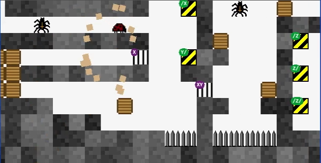

Lady-bux
--------

Nonsense ladybug regex builder game.

[](misc/test_run.webm)
<small>[mp4 version](misc/test_run.mp4)</small>

## Install

### Linux

- compile Raylib dynamically: https://github.com/raysan5/raylib#build-and-installation
- `make`

### OS-X

- clone into same folder:
  - `git clone git@github.com:itarato/jumper.git`
  - `git clone git@github.com:raysan5/raylib.git`
- `brew install raylib`
- `brew install gcc`
- `export CXX=/usr/local/Cellar/gcc/<INSTALLED_VERSION>/bin/g++`
- `cd jumper`
- `make -f MakefileOSX bundle`

### Runtime options

Configuration can be either added as command line arguments or a configuration file - or mixed (last one overrides).

```bash
$> ./jumper -conf default.conf -width 1280
```

For configuration options see [example.conf](./example.conf).

### Control

Keyboard:

* ← / → : move
* SPACE : jump / double jump
* ALT   : parachute
* CTRL  : dash
* X     : poop (enemy paralyzer)
* BACKPACE : restart level
* ENTER : skip (works on specific screens)
* `     : pause

Or compatible gamepad controller (eg XBox).

---

Wild west theme design credit to [Sandor Horvath](https://www.behance.net/lexdraw/appreciated)
